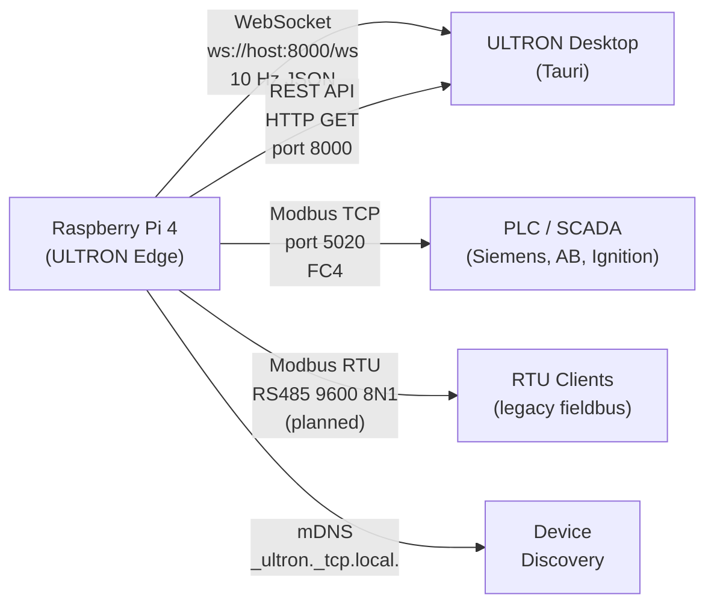
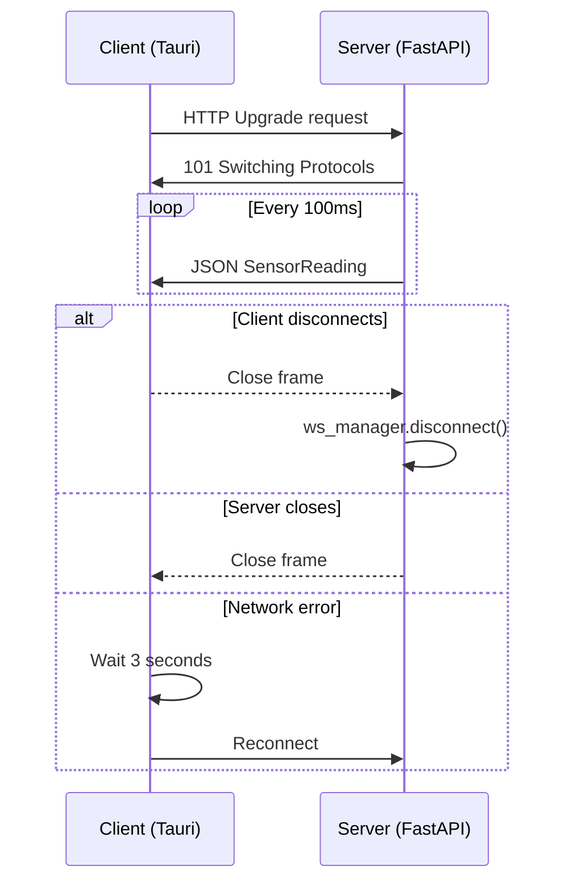
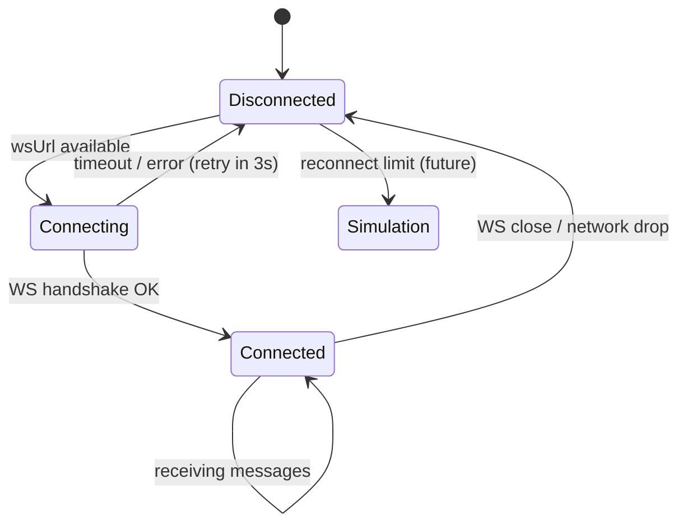
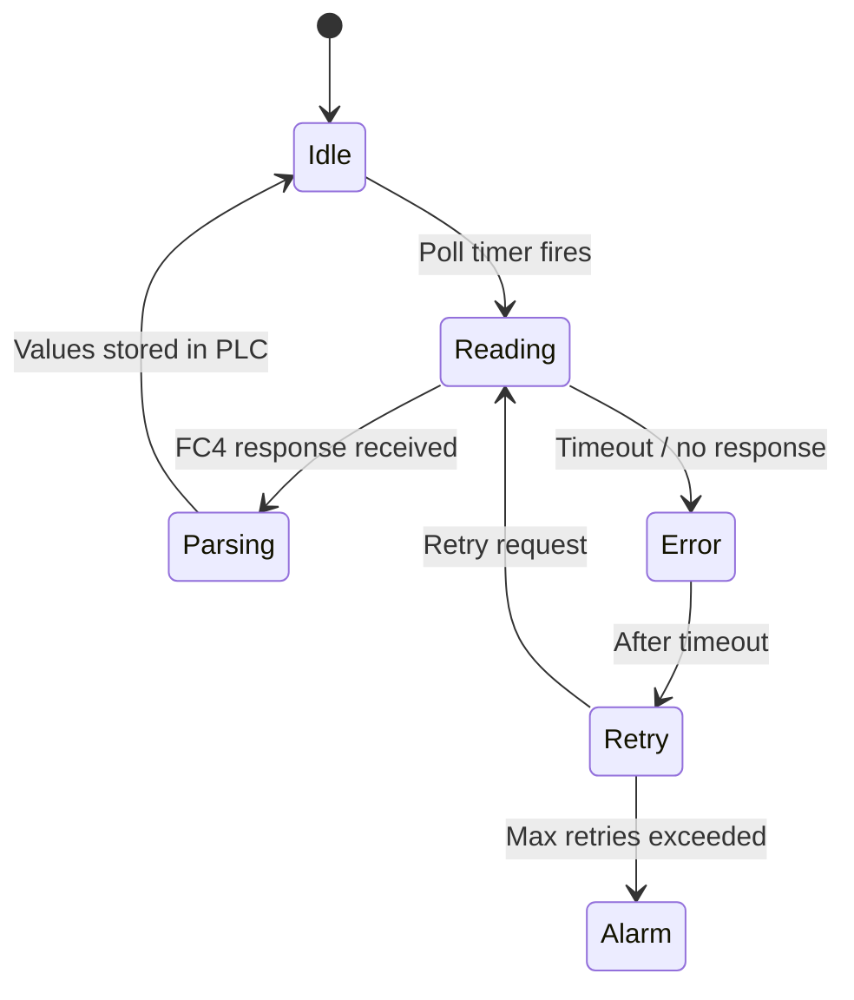

# PROTOCOLS.md
## ULTRON — Communication Architecture

**Purpose:** Document all communication protocols used or planned in ULTRON — WebSocket, REST, Modbus TCP, Modbus RTU, mDNS, and future protocols.
**Last Updated:** 2026-06-02
**Audience:** Software engineers, hardware engineers, integration specialists

> Cross-references: [API.md](API.md) | [MODBUS.md](MODBUS.md) | [SYSTEM_ARCHITECTURE.md](SYSTEM_ARCHITECTURE.md)

---

## Protocol Overview



---

## Table of Contents

1. [WebSocket Protocol](#1-websocket-protocol)
2. [REST API Protocol](#2-rest-api-protocol)
3. [Modbus TCP Protocol](#3-modbus-tcp-protocol)
4. [Modbus RTU Protocol](#4-modbus-rtu-protocol)
5. [mDNS / Zeroconf Discovery](#5-mdns--zeroconf-discovery)
6. [Protocol Priority and Failover](#6-protocol-priority-and-failover)
7. [Connection State Diagrams](#7-connection-state-diagrams)
8. [Future Protocols](#8-future-protocols)

---

## 1. WebSocket Protocol

### Purpose

Primary real-time data stream between ULTRON Edge and ULTRON Desktop (or any WebSocket client).

### Connection

```
ws://<device-ip>:8000/ws
```

### Message Direction

**Server → Client only** (unidirectional stream)

The server ignores any messages the client sends. The WebSocket is a push stream.

### Message Format

JSON text frames, sent every 100 ms:

```json
{
  "timestamp":   "2026-06-02T10:00:00.123456+00:00",
  "pressure":    7.35,
  "temperature": 82.1,
  "status":      "healthy"
}
```

### Connection Lifecycle



### Multiple Clients

The `WebSocketManager` maintains a list of connected clients. All connected clients receive every broadcast simultaneously. There is no per-client state or subscription filtering in Phase 1.

### Auto-Reconnect (Desktop Client)

`useWebSocket.ts` implements exponential reconnect with `RECONNECT_MS = 3000` (3 second fixed delay).

### Error Handling

- Server catches `WebSocketDisconnect` and cleans up silently
- Unexpected exceptions are logged and the connection is closed
- Client reconnects after 3 seconds in all error cases

---

## 2. REST API Protocol

### Purpose

- Device discovery (identity handshake)
- Health checks
- One-shot sensor reads (non-streaming clients)
- Modbus status and register documentation

### Details

See [API.md](API.md) for complete endpoint documentation.

| Property | Value |
|----------|-------|
| Base URL | `http://<device-ip>:8000` |
| Transport | HTTP/1.1 over TCP |
| Port | 8000 |
| Auth | None (Phase 1) |
| CORS | `allow_origins=["*"]` (development) |
| Response format | JSON |

### Key Endpoints

| Method | Path | Purpose |
|--------|------|---------|
| GET | `/health` | Liveness probe |
| GET | `/api/device/identity` | Device handshake for discovery |
| GET | `/sensors/latest` | One-shot sensor read |
| GET | `/api/modbus/status` | Modbus server status |
| GET | `/api/modbus/register-map` | Register documentation |

---

## 3. Modbus TCP Protocol

### Purpose

Industrial integration — PLCs, SCADA, HMIs.

### Connection Parameters

| Setting | Value |
|---------|-------|
| Host | `<Raspberry Pi IP>` |
| Port | 5020 (dev) / 502 (production — requires root) |
| Protocol | Modbus TCP over TCP/IP |
| Slave ID | 0 |
| Function code | FC4 (Read Input Registers) |
| Max frame | Standard 260 bytes |

### Frame Format

**Request (FC4):**
```
[Transaction ID: 2B] [Protocol ID: 2B=0x0000] [Length: 2B] [Unit ID: 1B]
[Function Code: 1B=0x04] [Starting Address: 2B] [Quantity: 2B]
```

**Response:**
```
[Transaction ID: 2B] [Protocol ID: 2B] [Length: 2B] [Unit ID: 1B]
[Function Code: 1B=0x04] [Byte Count: 1B] [Register Values: N×2B]
```

### Register Map

See [MODBUS.md](MODBUS.md) for the complete register map.

### Example Transaction

Read P1 pressure (display 30001–30002 = PDU 0–1):
```
Request:  00 01 00 00 00 06 00 04 00 00 00 02
Response: 00 01 00 00 00 07 00 04 04 40 EB 85 1F
                                           ↑↑↑↑↑↑↑↑
                                           0x40EB851F = 7.35 bar (Float32 ABCD)
```

### Server Status

The Modbus TCP server runs as a separate asyncio task managed by `ModbusService`. Status is queryable via `GET /api/modbus/status`.

---

## 4. Modbus RTU Protocol

### Purpose

Legacy RS485 fieldbus integration — older PLCs, remote terminal units.

### Status

**Implemented but not tested on physical hardware.**

Enable via `.env`:
```ini
MODBUS_RTU_ENABLED=true
MODBUS_RTU_PORT=/dev/ttyUSB0
```

### Serial Parameters

| Setting | Value |
|---------|-------|
| Baud Rate | 9600 |
| Data Bits | 8 |
| Parity | None (N) |
| Stop Bits | 1 |
| Format | 8N1 |
| Slave ID | 1 (configurable) |

### RS485 Electrical Requirements

| Requirement | Value |
|------------|-------|
| Bus topology | Daisy-chain (not star) |
| Termination resistors | 120 Ω at each end |
| Cable type | Shielded twisted pair, 120 Ω characteristic impedance |
| Max cable length | 1200 m at 9600 baud |
| Isolation | Recommended — use isolated USB-RS485 adapter |
| Direction control | Half-duplex — hardware or software flow control |

### Frame Format

**Request (FC4):**
```
[Slave ID: 1B] [Function Code: 1B=0x04] [Start Addr: 2B] [Count: 2B] [CRC: 2B]
```

**Response:**
```
[Slave ID: 1B] [Function Code: 1B=0x04] [Byte Count: 1B] [Data: N×2B] [CRC: 2B]
```

CRC is 16-bit CRC-Modbus (polynomial 0xA001, reflected).

### Differences from Modbus TCP

| Aspect | Modbus TCP | Modbus RTU |
|--------|-----------|-----------|
| Transport | TCP/IP | RS485 serial |
| Header | MBAP header (6 bytes) | None |
| Error check | TCP CRC | 16-bit CRC-Modbus |
| Multi-slave | Via Unit ID | Via Slave ID |
| Speed | Fast (network) | Slower (serial, 9600 baud) |
| Range | LAN/WAN | 1200 m RS485 bus |

---

## 5. mDNS / Zeroconf Discovery

### Purpose

Allow the ULTRON Desktop app to automatically find the Raspberry Pi on the local network without manual IP configuration.

### Service Advertisement

The backend advertises:

| Property | Value |
|----------|-------|
| Service type | `_ultron._tcp.local.` |
| Hostname | `ultron-edge.local` (configurable) |
| Port | 8000 |
| TXT records | `version=1.0.0`, `device_type=raspberry_pi_gateway` |

### Discovery Process

```
1. Backend starts → MDNSAdvertiser.start_async()
2. Advertises via zeroconf multicast UDP (port 5353)
3. Desktop app → useDeviceDiscovery hook
4. Sends mDNS query for _ultron._tcp.local.
5. Raspberry Pi responds with IP + port
6. Desktop probes GET /api/device/identity to confirm ULTRON device
7. Desktop connects WebSocket
```

### mDNS Library

Backend: Python `zeroconf` library (`MDNSAdvertiser` in `ultron-backend/app/discovery/mdns_advertiser.py`)

Desktop: Tauri native (`device_discovery.rs`) + React hook (`useDeviceDiscovery.ts`)

### Fallback Discovery

If mDNS fails (firewall, different network segment):
1. Subnet scan — desktop tries common IPs on the local subnet
2. Modbus TCP probe — checks if Modbus device answers at port 5020
3. Manual IP entry — user types IP in `ManualConnect.tsx`

---

## 6. Protocol Priority and Failover

### Dashboard Connection Priority

```
1. Last known IP (cached in config)  →  probe GET /api/device/identity
2. mDNS discovery                   →  probe GET /api/device/identity
3. Subnet scan                      →  probe GET /api/device/identity
4. Modbus TCP probe                 →  confirm via register identity
5. Simulation mode (fallback)       →  no device needed
```

### WebSocket Reconnect Policy

- Fixed 3-second delay between reconnect attempts
- No maximum retry limit — reconnects indefinitely
- If `reconnectCount` exceeds threshold, UI shows "simulation mode" banner

### Modbus vs WebSocket

Both protocols are served simultaneously. They are independent and do not interfere:
- WebSocket: primary for ULTRON Desktop
- Modbus TCP/RTU: primary for PLC/SCADA integration
- Both read from the same sensor data updated every 100 ms

---

## 7. Connection State Diagrams

### WebSocket Client State



### Modbus TCP Client State (PLC)



---

## 8. Future Protocols

### MQTT (Phase 5)

Purpose: Cloud data uplink from gateway to MQTT broker.

```
Raspberry Pi  →  MQTT over TLS  →  Cloud MQTT Broker (AWS IoT / HiveMQ)
```

| Topic pattern | Direction | Payload |
|---------------|-----------|---------|
| `ultron/{device_id}/sensors` | Edge → Cloud | SensorReading JSON |
| `ultron/{device_id}/alarms` | Edge → Cloud | Alarm event JSON |
| `ultron/{device_id}/config` | Cloud → Edge | Configuration updates |
| `ultron/{device_id}/cmd` | Cloud → Edge | Commands |

### OPC-UA (Phase 5+)

Purpose: Integration with advanced industrial SCADA platforms that require OPC-UA.

- ULTRON would act as an OPC-UA server
- Exposes sensor data as OPC-UA nodes
- Python library: `asyncua`

**Status:** Unknown / needs verification — depends on customer requirements.

### HTTPS (Production Security)

In production, the REST API and WebSocket should be served over TLS:
- `https://<device-ip>:8443`
- `wss://<device-ip>:8443/ws`

TLS termination: nginx reverse proxy on Raspberry Pi, or embedded in FastAPI with `ssl_certfile`/`ssl_keyfile`.

**Status:** Not yet implemented. Required before cloud deployment.
