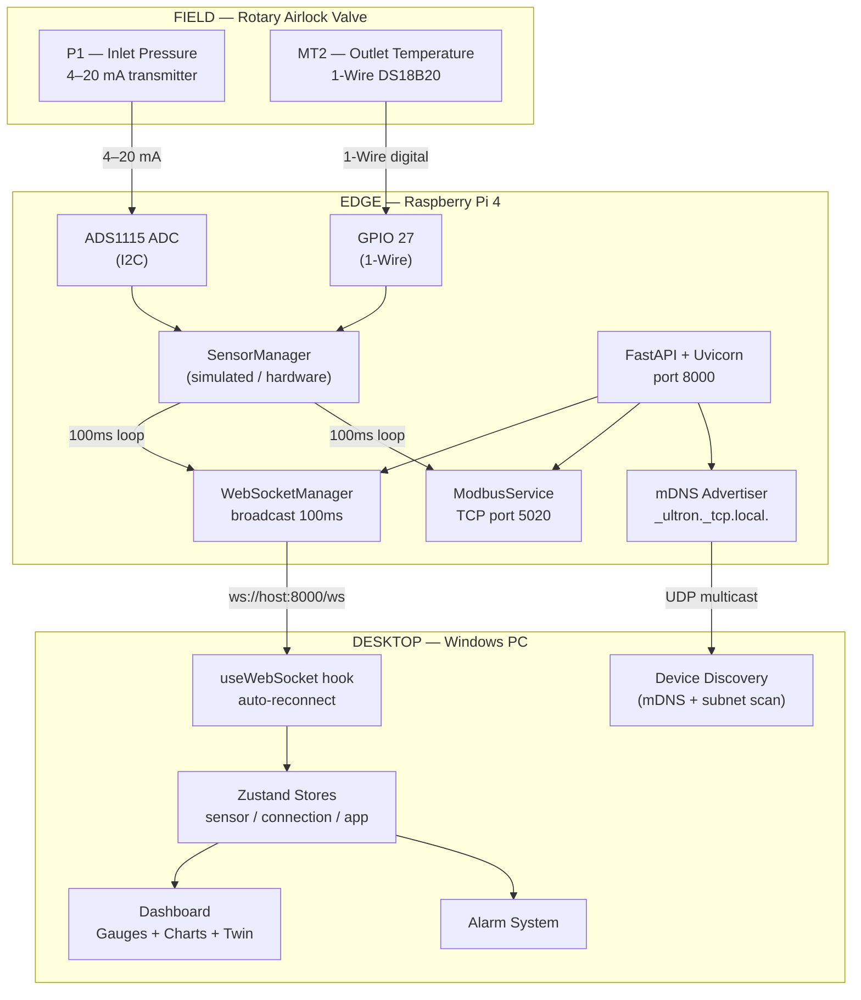
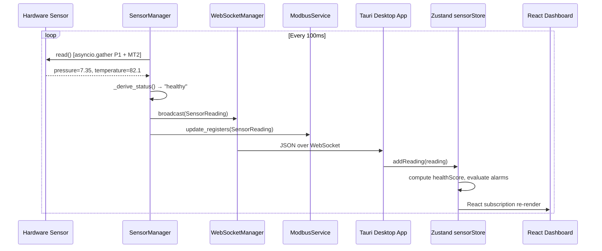
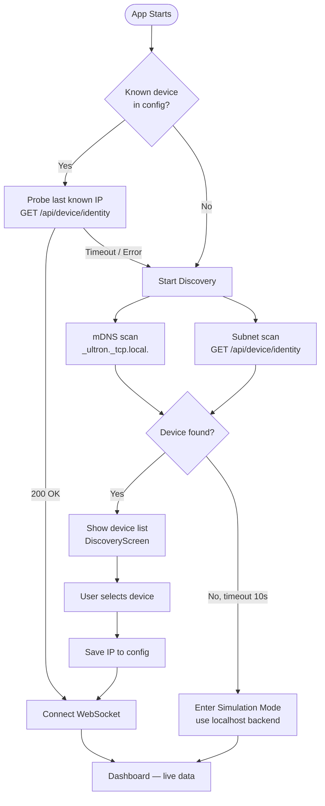
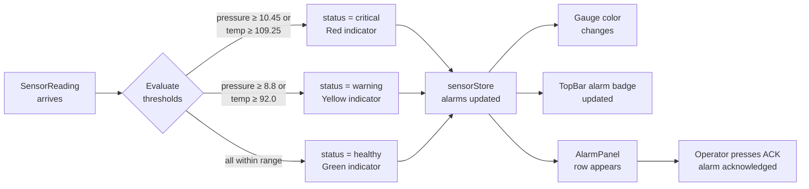
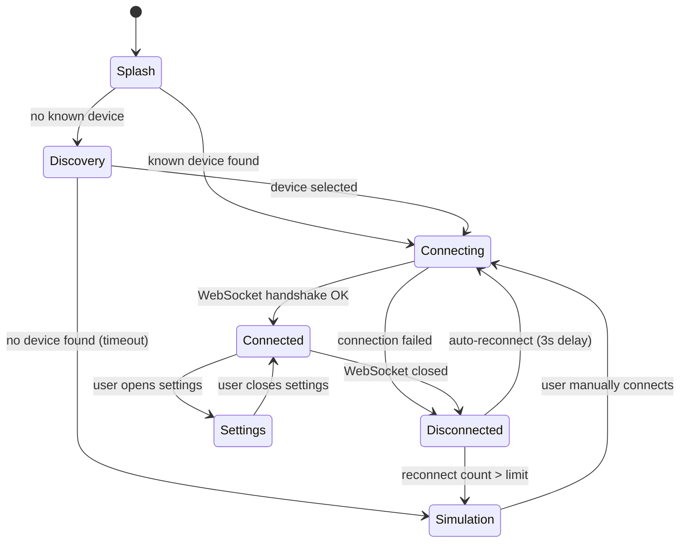
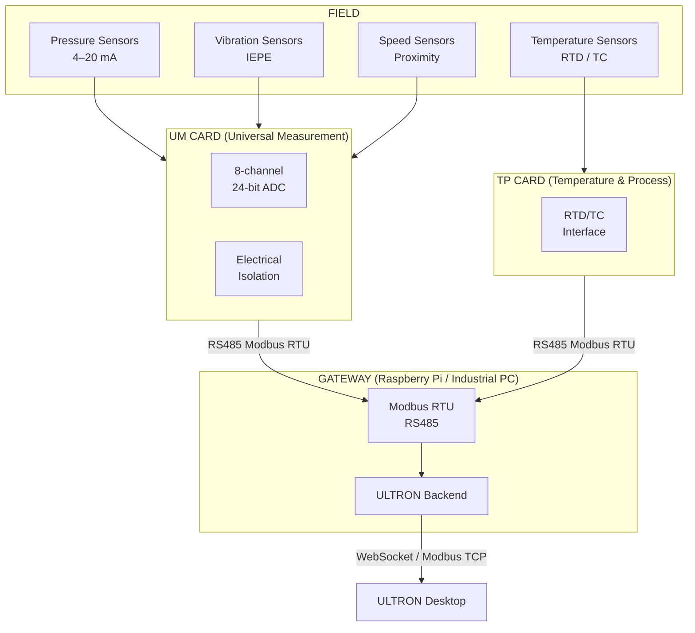
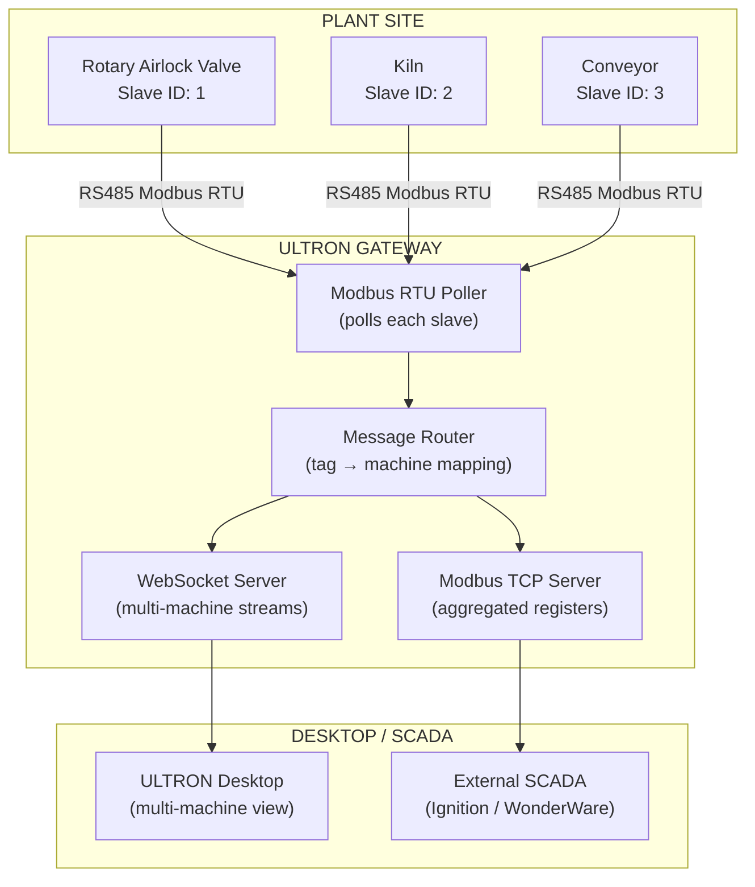
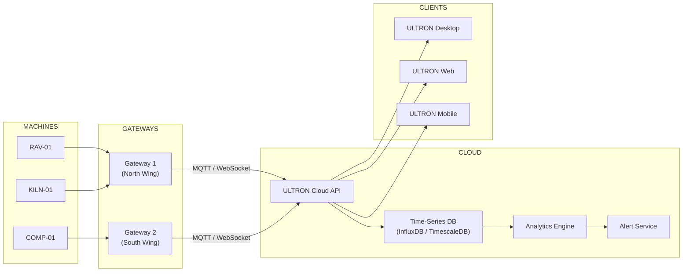
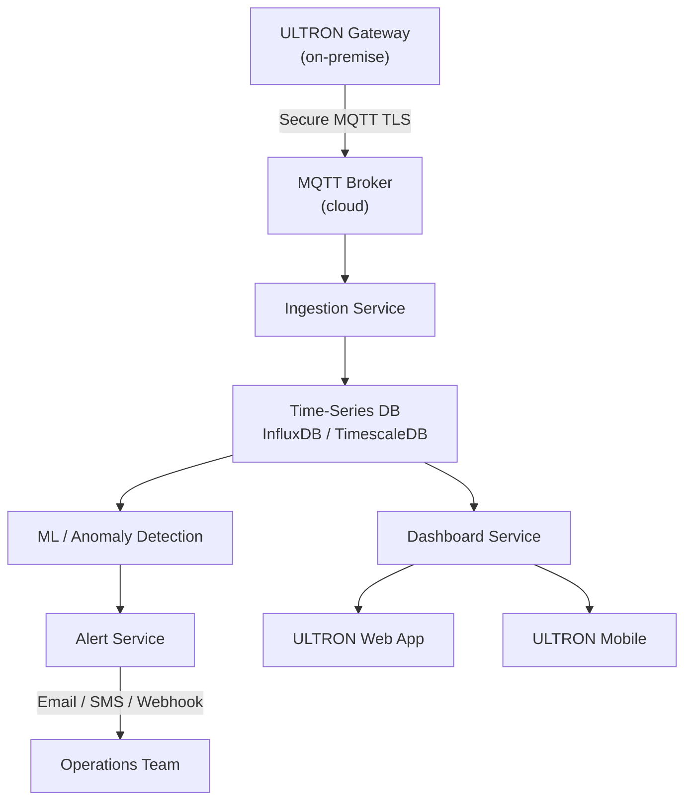

# SYSTEM_ARCHITECTURE.md
## ULTRON — System Architecture Reference

**Purpose:** High-level system design for all audiences — engineers, managers, interns.
**Last Updated:** 2026-06-02
**Audience:** Everyone

> Cross-references: [SOFTWARE.md](SOFTWARE.md) | [HARDWARE.md](HARDWARE.md) | [PROTOCOLS.md](PROTOCOLS.md) | [MODBUS.md](MODBUS.md)

---

## Table of Contents

1. [Architecture Overview](#1-architecture-overview)
2. [Phase 1 MVP Architecture](#2-phase-1-mvp-architecture)
3. [Component Descriptions](#3-component-descriptions)
4. [Data Flow](#4-data-flow)
5. [Device Discovery Flow](#5-device-discovery-flow)
6. [Alarm Flow](#6-alarm-flow)
7. [Connection State Machine](#7-connection-state-machine)
8. [Future Edge Architecture](#8-future-edge-architecture)
9. [Future Gateway Architecture](#9-future-gateway-architecture)
10. [Future Multi-Machine Architecture](#10-future-multi-machine-architecture)
11. [Future Cloud Architecture](#11-future-cloud-architecture)
12. [Protocol Stack](#12-protocol-stack)

---

## 1. Architecture Overview

ULTRON is an **Industrial Machine Monitoring Platform** with three tiers:

```
┌─────────────────────────────────────────────────────────────┐
│ TIER 1 — FIELD                                              │
│  Physical sensors on the machine                           │
│  (pressure transmitters, temperature sensors, etc.)        │
└──────────────────────┬──────────────────────────────────────┘
                       │ 4–20 mA / 1-Wire / RS485
┌──────────────────────▼──────────────────────────────────────┐
│ TIER 2 — EDGE                                               │
│  Raspberry Pi 4 running ULTRON Backend                     │
│  Reads sensors → serves WebSocket + Modbus TCP/RTU         │
└──────────┬──────────────────────────┬───────────────────────┘
           │ WebSocket / Modbus TCP   │ mDNS advertisement
┌──────────▼──────────────────────────▼───────────────────────┐
│ TIER 3 — PRESENTATION                                       │
│  ULTRON Desktop App (Tauri + React)                        │
│  Live gauges, trends, alarms, digital twin                 │
└─────────────────────────────────────────────────────────────┘
```

---

## 2. Phase 1 MVP Architecture



### Current Implementation Notes

- Both sensors currently in **simulation mode** — hardware drivers are stubs
- Modbus RTU server is implemented but not tested on physical RS485 hardware
- mDNS advertisement works — desktop auto-discovers the Raspberry Pi

---

## 3. Component Descriptions

| Component | Technology | Location | Responsibility |
|-----------|-----------|----------|---------------|
| **SensorManager** | Python | `ultron-backend/app/sensor_manager.py` | Reads P1 and MT2 every 100 ms; selects simulated or hardware sensor |
| **FastAPI App** | Python | `ultron-backend/app/main.py` | REST API + WebSocket endpoint; application lifespan management |
| **WebSocketManager** | Python | `ultron-backend/app/websocket_manager.py` | Connection registry; broadcasts SensorReading to all connected clients |
| **ModbusService** | Python | `ultron-backend/app/modbus/modbus_service.py` | Runs Modbus TCP/RTU servers; updates Input Registers on each sensor read |
| **MDNSAdvertiser** | Python | `ultron-backend/app/discovery/mdns_advertiser.py` | Advertises ULTRON device on LAN via Zeroconf |
| **Tauri Shell** | Rust | `ultron-desktop/src-tauri/` | Native window; spawns Python backend; Tauri commands bridge |
| **React App** | TypeScript | `ultron-desktop/src/` | UI dashboard; state management; WebSocket client |
| **useWebSocket** | TypeScript | `ultron-desktop/src/hooks/useWebSocket.ts` | WebSocket connection management; auto-reconnect; feeds sensorStore |
| **sensorStore** | TypeScript | `ultron-desktop/src/store/sensorStore.ts` | Readings ring buffer; health score; alarm evaluation |
| **DashboardPage** | TypeScript | `ultron-desktop/src/pages/DashboardPage.tsx` | Fixed-viewport layout: gauges + digital twin + trend chart |
| **RotaryAirlockValveSvg** | TypeScript/SVG | `ultron-desktop/src/components/process/RotaryAirlockValveSvg.tsx` | Inline SVG digital twin with 11 sensor dot overlays |

---

## 4. Data Flow

### Sensor Reading → Dashboard (End-to-End)



### WebSocket Message Format

```json
{
  "timestamp": "2026-06-02T10:00:00+00:00",
  "pressure":  7.35,
  "temperature": 82.1,
  "status": "healthy"
}
```

Status values: `healthy` | `warning` | `critical` | `offline`

---

## 5. Device Discovery Flow



### Discovery Protocols (in priority order)

1. **Cached last-known IP** — fastest; checked first
2. **mDNS** — `_ultron._tcp.local.` — finds device if on same LAN segment
3. **Subnet scan** — tries common IPs; slower but reliable
4. **Modbus TCP probe** — checks if Modbus device responds at port 5020
5. **Simulation mode** — fallback when no device found

---

## 6. Alarm Flow



### Alarm Thresholds (Frontend — `constants.ts`)

| Parameter | Warning | Critical |
|-----------|---------|----------|
| Pressure | ≥ 8.8 bar | ≥ 10.45 bar |
| Temperature | ≥ 92.0 °C | ≥ 109.25 °C |

### Visual Alarm Indicators

| Location | Normal | Warning | Critical |
|----------|--------|---------|----------|
| Gauge color | `--ok` (#20D068 green) | `--warn` (#FFB020 amber) | `--crit` (#FF4040 red) |
| TopBar badge | Hidden | Amber count | Red count |
| AlarmPanel | Empty | Row with yellow tag | Row with red tag |
| Sensor dot (SVG) | Green | Amber | Red |
| Machine SVG glow | None | Yellow | Red |

---

## 7. Connection State Machine



---

## 8. Future Edge Architecture

Phase 4 — support for dedicated measurement cards:



---

## 9. Future Gateway Architecture

Phase 4 — multiple machines, one gateway:



---

## 10. Future Multi-Machine Architecture

Phase 5:



---

## 11. Future Cloud Architecture

Phase 5:



---

## 12. Protocol Stack

| Layer | Protocol | Current | Future |
|-------|---------|---------|--------|
| Sensor → Edge | 4–20 mA (analog), 1-Wire, RS485 | ✅ Phase 1 | Wireless sensors (Phase 4) |
| Edge internal | I2C (ADC), GPIO | ✅ Phase 1 | SPI (Phase 3 vibration) |
| Edge → Desktop | WebSocket (JSON, 10 Hz) | ✅ Phase 1 | — |
| Edge → SCADA | Modbus TCP (port 5020) | ✅ Phase 1 | — |
| Edge → Fieldbus | Modbus RTU (RS485) | ⚠️ Implemented, untested | — |
| Discovery | mDNS (Zeroconf) + subnet scan | ✅ Phase 1 | — |
| Edge → Cloud | — | ❌ Not implemented | MQTT TLS (Phase 5) |
| Cloud → Clients | — | ❌ Not implemented | REST + WebSocket (Phase 5) |
| Future | OPC-UA | ❌ Future | Phase 5+ |

Full protocol documentation: [PROTOCOLS.md](PROTOCOLS.md)
Modbus register map: [MODBUS.md](MODBUS.md)
